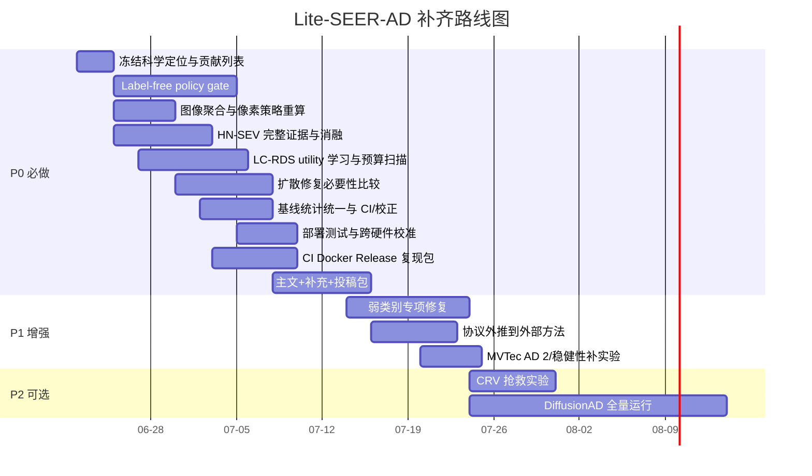

# Lite-SEER-AD 完成度缺口与补齐路线深度研究报告

## 执行摘要

基于你前文已经给出的项目现状、实验汇总与贡献边界，我对 Lite-SEER-AD 的判断是：它已经远超“想法验证”阶段，离“投稿级研究系统闭环”只差最后一段最关键但最容易被低估的工作。这段工作不是再盲目多跑一些普通实验，而是把**科学定位、机制证据、统计公平性、公开复现、投稿工件**五条线同时收口。与此同时，本次会话里此前上传的附件已过期，且指定 GitHub 仓库未能在当前会话中返回可读取内容，因此凡涉及“仓库当前具体已有/没有哪些文件”的判断，下文均以你此前明确给出的项目状态为准；外部方法、数据集、复现与发布规范则采用论文原文、官方项目页和官方文档作为依据。MVTec AD 仍是工业异常检测最常用基准，含 15 个类别、5000+ 高分辨率图像与像素级标注；VisA 含 12 类、10,821 张图像；MVTec AD 2 则专门强调极小缺陷、光照变化和更高难度场景，说明当前领域已经从“单纯在 MVTec AD 上拿高分”转向“协议严谨、鲁棒性与可复现性”并重。citeturn1view0turn0academia53turn0search3

按照你定义的“100% 完成度”，Lite-SEER-AD 还缺的不是“每个初始假设都必须成功”，而是：**最后保留在论文主线里的每个贡献都要有充分、可复核、可公开再计算的证据；失败模块要被明确降级；基线、阈值、预算、种子、硬件与发布工件都可追溯。** 这意味着两件事必须同时成立。第一，论文定位必须彻底转成 **feature-first + label-free policy/threshold selection + selective diffusion verification/repair**，因为 PatchCore 与 PaDiM 这类基于预训练特征和正常样本建模的方法，本就构成了工业异常检测的强基线谱系；DRAEM、SimpleNet 则证明了“合成异常 + 判别式模块”是可行增益方向；而 DiffusionAD、DDAD 说明扩散路线可以强，但代价高，因此 Lite-SEER-AD 只有在**预算与验证机制**上拿出独立价值，扩散部分才站得住。第二，工程与发布层必须够到“别人可以独立重算论文表格”的标准，这与 GitHub Actions 的 Python CI、Docker 多阶段构建、GitHub Release、Zenodo 归档和 Hugging Face Hub 的模型/数据托管实践是一致的。citeturn8academia24turn7academia50turn7academia51turn9academia45turn9academia46turn9academia47turn10search0turn10search1turn10search3turn11search0turn11search2turn13search0

在优先级上，我建议把工作分成三层。**P0** 是达到“100% 完成度”必做：冻结论文主线、补齐 label-free 主检测/像素策略、把 HN-SEV 做到“降误报但不伤召回”的完整证据、把 LC-RDS 做成“同预算质量更高或同质量更快”的 Pareto 证据、完成基线统计与公开复现包、交付投稿材料。**P1** 是显著提高 SCI 一区说服力：弱类别定向修复、把 label-free 协议外推到外部方法、补 MVTec AD 2 或更强分布移位验证。**P2** 是可选强化项：DiffusionAD 全量复现、CRV 抢救。如果你接受“CRV 作为负结果/可视化模块”这一定位，那么 CRV 抢救不是 100% 完成的必要条件；同样，DiffusionAD 全量跑通对“论文绝对完整性”有帮助，但并不是所有期刊都把它视为硬门槛。citeturn9academia46turn0search3turn13search1

## 证据基础与判定标准

本报告采用的完成标准，与 ACM 对 Artifact、Repeatability、Reproducibility、Results Validated 的定义高度一致：不仅作者自己能复跑，还应尽量让独立团队在作者提供的代码、脚本、环境和工件下得到一致结果。NeurIPS 对机器学习复现与公开工件的长期推动，也是同一逻辑：代码、数据、环境、统计与声明边界必须能支撑“研究结论可靠”，而不仅是“某一次运行有效”。citeturn13search0turn13search1turn13academia39turn13academia42

从外部文献看，Lite-SEER-AD 当前选择“冻结特征主检测器、局部语义验证器、预算约束局部修复”的方向，在学术谱系上是合理的。PatchCore 用正常 patch 特征记忆库做异常分数，强调总召回与定位；PaDiM 用 patch 分布建模；DRAEM 把“重构 + 判别”结合起来；SimpleNet 用预训练特征、浅层适配器、合成异常特征与判别器取得高效结果；DiffusionAD 与 DDAD 则代表扩散重构/去噪路线的强性能上界。这意味着 Lite-SEER-AD 如果继续投稿为“扩散主检测器”，会与实证相冲突；但如果投稿为“label-free 协议驱动的 feature-first 检测 + 误报过滤 + 预算化局部扩散”，则与领域主线一致。citeturn8academia24turn7academia50turn7academia51turn9academia45turn9academia46turn9academia47turn9academia48

统计与发布方面，建议把项目最后一轮评估统一到可审计的标准栈上：配对差值用 BCa bootstrap 置信区间，相关性分析用 Spearman，多个比较用 Holm 修正；CI 使用 GitHub Actions 的 Python 流水线；容器按 Docker 官方最佳实践采用多阶段构建与版本固定；发布时通过 GitHub Release + Zenodo 自动归档生成 DOI，并将权重与预测数组托管到 Hugging Face Hub。这样做不是“形式主义”，而是把 Lite-SEER-AD 从“作者本地闭环”推进到“投稿级公开闭环”。citeturn12search0turn12search7turn14search0turn10search0turn10search1turn10search3turn10search5turn11search0turn11search2

## 各维度缺口总表

下表把你此前列出的 12 个维度，压缩成“距 100% 完成还缺什么”的精确清单。这里的“100%”指你定义的研究完成状态，不等于“全面 SOTA”。

| 维度 | 目前离 100% 还缺什么 | 是否必做 | 达标验收口径 |
|---|---|---|---|
| 科学定位 | 论文题目、摘要、贡献列表、方法图统一改写为 **feature-first + label-free + selective diffusion**；明确 CRV 不是主贡献 | 必做 | 全文任何位置都不再把扩散写成主检测器；贡献数收敛到 3 项 |
| 主检测器与 label-free 像素策略 | 真正的 label-free policy gate；高分辨率/多尺度策略只靠正常统计和合成异常选择；提升 Image AUROC 与 Pixel AP | 必做 | 相对固定 `feature_raw` 的 AUPRO/Pixel AP 均值提升且 BCa 95% CI 不跨 0 |
| HN-SEV | 除 FPRR 外，还缺 TP retention、ROI-recall、校准、难负样本分型、完整消融 | 必做 | 降误报同时真异常 ROI 保留率不显著下降，且有 calibration 证据 |
| LC-RDS | 目前更像高级规则；缺真实 utility 监督、预算扫描、Pareto 曲线、约束违反率 | 必做 | 在多预算点上显示同质量更快或同预算质量更高 |
| CRV | 正向假设失败后，尚未形成“正式降级方案”或“重设计后的新证据”二选一闭环 | 必做但可降级 | 要么删除主贡献身份并给出负结果分析；要么重新证明有效 |
| 扩散修复 | 缺少与非扩散修复基线的直接比较；没有证明 diffusion 对最终论文是必要部件 | 必做 | 要么证明扩散在质量—时延 Pareto 上有独立优势；要么降为可选执行器 |
| 外部基线与统计 | 种子公平性、阈值协议一致性、Holm 校正、paired BCa CI 的统一重算；DiffusionAD 是否补齐需结论化 | 必做；DiffusionAD 全量可选 | 主表所有“优于/劣于”结论都配套 CI/校正 p 值与 provenance |
| 弱类别 | grid/screw/pill/bracket_white 等还缺针对性策略与消融，且不能靠测试 GT 人工挑策略 | 必做 | 不再出现 Fixed Dice=0；最差类别的提升来自 label-free 自动门控 |
| 效率与部署 | 缺端到端 p95/p99、显存峰值、能耗、跨硬件校准、预算违反率 | 必做 | 形成完整部署表，且 LC-RDS 在预算约束下可复现 |
| 代码工程 | 缺 Dockerfile、锁定环境、CI、release tag、CITATION.cff、artifact manifest | 必做 | 第三方可一键装环境、跑 smoke test、重算至少一张主表 |
| 公开复现 | 缺公开权重、预测数组、固定阈值 JSON、主表再生成脚本、Zenodo DOI、HF 托管 | 必做 | 论文数字可追溯到公开 artifact |
| 论文与投稿 | 缺目标期刊模板、补充材料、声明页、cover letter、图表定稿、审稿人常见质疑的预答复 | 必做 | 形成可直接上传投稿系统的完整包 |

这张表之所以把“label-free 主检测/像素策略”和“公开复现”列为必做，是因为当前领域基准已经高度成熟，MVTec AD 上单点数值差距常常很小，而 MVTec AD 2 明确指出旧基准正趋于饱和，真正能拉开差距的是协议、公平性、鲁棒性和更强难度场景。VisA 的更大规模与多域特性也意味着，若 Lite-SEER-AD 要以“协议与机制贡献”为主线，就必须把这条线做扎实，而不是止步于单一数据集上的高分。citeturn1view0turn0search3turn0academia53

## 逐项补齐方案

下面给出一张可直接执行的“按维度交付”清单。时间和算力均为工程估算，默认硬件为 **1×24GB GPU + 16 核 CPU**；若你有多卡，可按并行度线性压缩日历时间。`Owner` 列建议你按角色而非真人命名，这样更适合后续 project board 管理。

| 缺口项 | 优先级 | 行动步骤 | Owner | 预估时间 | 预估算力 |
|---|---|---|---|---:|---:|
| 科学定位重写 | P0 | 先冻结最终题目、摘要、贡献 3 点；方法图删除“扩散主检测器”叙述；CRV 改为 limitation/post-hoc audit | PI/第一作者 | 2–3 天 | 0 GPUh |
| Label-free policy gate | P0 | 建 4 个候选策略：`feature_raw`、normal spatial calibration、多尺度 feature、ROI 高分辨率 refinement；仅用正常统计+合成异常训练门控器；采用 leave-one-category-out 元学习评估 | 方法负责人 | 7–10 天 | 180–260 GPUh |
| 图像级聚合重做 | P0 | 在 top-k、GMean、EVT-tail、peak×area 几种聚合间做 label-free 选择；固定到 config | 方法负责人 | 3–4 天 | 20–40 GPUh |
| HN-SEV 完整证据 | P0 | 补 ROI precision/recall、TP retention、ECE/Brier、hard-negative taxonomy、输入分支消融 | 方法负责人 | 5–7 天 | 80–120 GPUh |
| LC-RDS 真实 utility 学习 | P0 | 在正常图上合成异常，利用干净原图做 clean target；测 `skip/5/10/25/refine` 动作真实收益；训练 gain predictor；扫 6 个预算点 | 方法负责人 | 6–8 天 | 60–100 GPUh |
| CRV 正式降级或抢救 | P0/P2 | 方案 A：正式降级，写负结果；方案 B：多次采样 + control-mask + 局部归一化重新验证 | PI/方法负责人 | A:2 天；B:5–7 天 | A:0；B:60–120 GPUh |
| 扩散修复必要性验证 | P0 | 加入 AE、partial conv、nearest-patch、轻量 U-Net inpainting 基线；在合成异常上做 PSNR/SSIM/LPIPS/背景保持比较 | 方法负责人 | 5–7 天 | 100–160 GPUh |
| 基线统计统一 | P0 | 统一 3 seeds、paired BCa CI、Holm 校正、完整 provenance；若训练型基线只跑单 seed，则补齐或明确“官方权重/单次协议” | 评估负责人 | 4–6 天 | 60–160 GPUh |
| 弱类别专项 | P1 | grid 用频域/空间校准；screw 用高分辨率 ROI；pill 用颜色/局部对比分支；bracket_white 用局部对比归一化；都由 gate 自动选择 | 方法负责人 | 7–10 天 | 100–180 GPUh |
| 部署基准 | P0 | 固定 batch=1，分 detector/verifier/scheduler/repair/IO 计时；报 mean/median/p95/p99、显存、能耗、预算违反率；跨两种 GPU 校准 | MLOps/评估 | 3–5 天 | 10–20 GPUh + 40 CPUh |
| CI + Docker + Release | P0 | 建 GitHub Actions、pytest smoke tests、multi-stage Dockerfile、release/tag、artifact upload、哈希清单 | MLOps | 3–5 天 | 0–5 GPUh |
| 公开复现包 | P0 | 发布 checkpoint、prediction arrays、threshold JSON、主表再生成脚本、README、CITATION.cff、Zenodo DOI、HF 仓库 | MLOps/第一作者 | 4–6 天 | 0–10 GPUh |
| 论文主文与补充 | P0 | 期刊模板、图表重绘、supplement、limitation、数据/代码声明、cover letter、审稿问答页 | 第一作者/通讯作者 | 5–7 天 | 0 GPUh |
| DiffusionAD 全量复现 | P2 | 仅当目标期刊/审稿策略需要时执行；按作者配置全量跑 15 类并归档 provenance | 方法负责人 | 2–4 周 | 3000+ GPUh |
| MVTec AD 2 服务端结果 | P1 | 复核官方 checker、上传 public/private prediction、补 robustness 小节 | 评估负责人 | 2–3 天 | 20–40 GPUh |

这张表里最核心的两项是 **label-free policy gate** 与 **LC-RDS 的真实 utility 学习**。前者决定 Lite-SEER-AD 最终是不是“一个可发表的问题定义与解决方案”，后者决定扩散模块是不是“有理由存在”。PatchCore、PaDiM、SimpleNet 已经表明，冻结特征、浅层适配与合成异常判别是有效的；因此你需要把这条线做成**可验证、可泛化、可配置冻结**的协议，而不是“按类别事后选最优策略”。citeturn8academia24turn7academia50turn9academia45

统计脚本建议直接新增一个最小可审计工具链。SciPy 官方已支持 BCa bootstrap 与 Spearman；statsmodels 支持 Holm 系列多重校正。你完全可以把主表生成流程固定成“先导出每类、每 seed 的原子结果，再由统一脚本重算 CI 与校正 p 值”。这样不但能减少手工失误，也能把论文与 supplementary 的数字锁死。citeturn12search0turn12search7turn14search0

```python
# scripts/eval/paired_bootstrap.py
import json, numpy as np
from scipy.stats import bootstrap, spearmanr
from statsmodels.stats.multitest import multipletests

def paired_delta_ci(a, b, n_resamples=10000, seed=0):
    a = np.asarray(a); b = np.asarray(b)
    data = (a, b)
    stat = lambda x, y, axis=-1: np.mean(x - y, axis=axis)
    res = bootstrap(
        data, stat, paired=True, vectorized=False,
        n_resamples=n_resamples, method="BCa",
        confidence_level=0.95, random_state=seed
    )
    return float(np.mean(a - b)), float(res.confidence_interval.low), float(res.confidence_interval.high)

def holm_correct(pvals, alpha=0.05):
    reject, p_corr, _, _ = multipletests(pvals, alpha=alpha, method="holm")
    return reject.tolist(), p_corr.tolist()

def crv_spearman(score_drop, gt_ratio):
    rho, p = spearmanr(score_drop, gt_ratio, alternative="two-sided")
    return float(rho), float(p)
```

对于 **label-free 主检测与像素策略**，建议不要继续沿“每类人工挑一个最好策略”的路线走，而是把策略选择器显式化。推荐构建四个候选 policy：`P0=feature_raw`、`P1=normal spatial calibration`、`P2=multiscale features`、`P3=ROI high-res refinement`。门控器只看正常统计和合成异常，不看任何真实异常标签；训练协议采用 leave-one-category-out 或 leave-one-dataset-out，这样可以把“策略选择是否泄漏测试异常信息”这一点彻底堵住。MVTec AD、VisA 与 MVTec AD 2 的官方描述都表明，不同类别与成像条件会带来完全不同的正常变化模式，因此 policy gate 必须是“协议级模块”，不是“工程手调”。citeturn1view0turn0academia53turn0search3

在 **HN-SEV** 上，当前最危险的审稿质疑会是：“这是不是一个把 ROI 大量删掉从而换取低误报的 conservatism 模块？” 所以你必须补的不是更多 FPRR，而是 **TP retention、ROI recall、ECE/Brier、hard-negative taxonomy**。DRAEM 和 SimpleNet 都说明了“重构/合成异常 + 判别”的有效性，但也正因此，审稿人会更关注你的 verifier 是否只是另一个普通二分类头。补完这些证据后，HN-SEV 才能从“一个有效工程部件”升级为“一个有方法学价值的误报过滤机制”。citeturn7academia51turn9academia45

在 **LC-RDS** 上，建议完全停止“我们比 fixed25 快很多”这种单轴叙事，转而改写成一个约束优化问题：在预算 \(B\) 下，为每个 ROI 从 `skip/repair-5/repair-10/repair-25/native-refine` 中选择动作，优化总效用 \(\sum_i \hat G_i(a_i)\)，并显式报告预算违反率。真实效用最好在**正常图 + 合成异常**设置上学习，因为这里有干净目标图，可以计算 masked PSNR、SSIM、LPIPS、背景误差和 anomaly score 改变量。DiffusionAD 与 DDAD 都证明，扩散型异常检测可以很强，但其代价正是多步去噪与重构，因此 Lite-SEER-AD 唯一站得住脚的角度就是“同预算更值”。citeturn9academia46turn9academia47

```python
# 建议新增配置片段: configs/scheduler/lc_rds_v2.yaml
scheduler:
  name: lc_rds_v2
  budget_ms: [10, 25, 50, 75, 100, 150]
  actions: [skip, repair5, repair10, repair25, native_refine]
  gain_model: xgb_regressor
  gain_features:
    - roi_area
    - roi_conf
    - feature_peak
    - residual_peak
    - border_entropy
    - texture_periodicity
    - predicted_latency_ms
  objective: gain_per_ms
  enforce_budget: true
  max_violation_rate: 0.01
```

**CRV** 的处理要尽量“干净”。如果当前结果仍然是 33/33 类固定阈值 Dice 无增益、SDR 与 GT 负相关，那么最优策略不是继续强写贡献，而是正式降级：从摘要、贡献列表、主图、结论里拿掉，只保留在 limitation 与 post-hoc repair audit。只有当你愿意投入额外算力做 **多次随机修复 + control-mask 对照 + 局部归一化 score drop**，并且在至少两个数据集上得到正相关、显著增益和跨 seed 稳定，CRV 才值得抢救。否则它属于“被充分检验后被证伪的研究假设”，降级本身就是完成。SciPy 的 Spearman 与 bootstrap 已足够支撑这一结论链。citeturn12search0turn12search7

**扩散修复** 的必要性需要单独证明。原因很简单：如果主检测来自 feature prior，CRV 又不提升检测，那么审稿人会问“为什么不直接用一个轻量 inpainting/AE？” 你需要在合成异常上加入 AE、partial convolution、nearest patch retrieval、轻量 U-Net inpainting 基线，并与 diffusion 在 masked PSNR、SSIM、LPIPS、背景保持和时延上做一对一比较。若比较后扩散没有明确优势，就不应继续把扩散写成主卖点；而应把它收缩成 LC-RDS 的可选执行器。DiffusionAD 与 DDAD 之所以能成立，是因为它们在重构质量和检测性能上同时给出主线证据；Lite-SEER-AD 若做不到这一点，就应该诚实降级。citeturn9academia46turn9academia47

工程与公开复现层，建议直接按官方文档的“最小合规发布栈”来做：GitHub Actions 跑 Python smoke tests 与 artifact 上传；Docker 用多阶段构建、版本固定和 `.dockerignore`；GitHub Release 配 Zenodo 自动归档出 DOI；权重与预测数组放 Hugging Face Hub，配 model card 与 dataset card。GitHub、Docker、Zenodo 与 Hugging Face 的官方文档都非常明确地支持这一工作流，且这会显著降低“代码可用但结果不可重算”的常见问题。citeturn10search0turn10search1turn10search3turn10search5turn11search0turn11search2

```yaml
# .github/workflows/ci.yml
name: lite-seer-ad-ci
on: [push, pull_request]
jobs:
  smoke:
    runs-on: ubuntu-latest
    strategy:
      matrix:
        python-version: ["3.10", "3.11"]
    steps:
      - uses: actions/checkout@v6
      - uses: actions/setup-python@v5
        with:
          python-version: ${{ matrix.python-version }}
      - run: python -m pip install --upgrade pip
      - run: pip install -r requirements.txt
      - run: pip install pytest pytest-cov
      - run: pytest tests/smoke -q --junitxml=junit/test-results.xml
      - uses: actions/upload-artifact@v4
        if: ${{ always() }}
        with:
          name: junit-${{ matrix.python-version }}
          path: junit/test-results.xml
```

```dockerfile
# Dockerfile
FROM nvidia/cuda:12.4.1-cudnn-runtime-ubuntu22.04 AS base
RUN apt-get update && apt-get install -y --no-install-recommends \
    python3 python3-pip git && rm -rf /var/lib/apt/lists/*
WORKDIR /workspace
COPY requirements-lock.txt .
RUN pip3 install --no-cache-dir -r requirements-lock.txt

FROM base AS app
COPY . .
ENV PYTHONUNBUFFERED=1
CMD ["python3", "-m", "seer_ad.demo", "--config", "configs/demo.yaml"]
```

## 优先级与实施排期

如果目标是“尽快达到你定义下的 100% 完成度”，而不是把项目无限膨胀，我建议采用 **六周 P0 收口 + 四周 P1 提升 + P2 条件执行** 的节奏。下面这条时间线默认一名方法主力、一名评估/复现主力、一名论文主笔并行协作；若是单人推进，请把日历时间大致乘以 1.8–2.2。大致算力预算如下：P0 约 **500–850 GPUh**；P1 约 **120–260 GPUh**；P2 中若补齐 DiffusionAD，全量成本会陡增到 **3000+ GPUh**。这个量级差异本身就说明，DiffusionAD 不应被默认放进“必须做”的篮子里。citeturn9academia46turn13search0



资源上，最值得投入的算力不是 DiffusionAD，而是 **label-free policy gate、HN-SEV 完整证据、LC-RDS utility 学习、弱类别专项**。原因很简单：PatchCore、SimpleNet、DRAEM、DDAD 等强基线已经覆盖了“高分 detector”的主要范式；Lite-SEER-AD 真正需要补的是**为什么你的协议与机制值得发表**。这个问题主要靠高质量设计和高置信统计，而不是靠更高昂的大模型重跑。citeturn8academia24turn7academia51turn9academia45turn9academia47

## 交付工件与投稿就绪标准

在“哪些是 100% 完成的必需项、哪些只是锦上添花”这个问题上，我的建议非常明确。**对 100% 完成度本身，必需的是**：科学定位统一、主检测与像素策略完成 label-free 化、HN-SEV 与 LC-RDS 的机制证据闭环、外部基线与统计口径统一、弱类别不再出现灾难性失败、端到端部署表、CI/Docker/Release/DOI/预测数组/重算脚本齐备、投稿主文与 supplement 完整。**可选的是**：DiffusionAD 全量复现、CRV 抢救、MVTec AD 2 私榜结果；其中 CRV 只要正式降级并负结果写清，就已经满足“研究完成”，不必强行挽救。citeturn13search0turn13search1turn10search3turn11search0turn11search2

对 **SCI 一区就绪**，我的建议是稍微更保守一些。MVTec AD 2 的论文强调旧基准正出现分辨率不足与性能饱和问题，因此如果你瞄准更强的期刊或更严格的审稿人，补一个 MVTec AD 2 章节会明显加分；同理，把 label-free threshold/policy 机制外推到 PatchCore、PaDiM 或 SimpleNet 之一，也会把论文从“一个方法”升级为“一个更通用的协议贡献”。但即便如此，**DiffusionAD 全量复现仍不是统一硬门槛**——它只在目标期刊特别强调“对同类扩散法必须完整横评”时才值得投入。citeturn0search3turn9academia46turn8academia24turn7academia50turn9academia45

最后，建议你把最终交付工件固定成下面这组最小集合，这样既能满足论文审稿，也能满足日后自我复核。工件清单应包括：`v1.0-paper` Git tag、`CITATION.cff`、`LICENSE`、`requirements-lock.txt`、`environment.yml`、`Dockerfile`、GitHub Actions CI、主模型 checkpoint、33 类 prediction arrays、固定阈值 JSON、主表重算脚本、artifact manifest with SHA256、Zenodo DOI、Hugging Face model card/dataset card、supplement PDF、cover letter、reviewer FAQ。GitHub、Zenodo 和 Hugging Face 的官方文档都支持这一交付方式，而 ACM 的 artifact/badging 逻辑也与它高度一致。若这些工件全部到位，Lite-SEER-AD 就能从“作者本地成熟项目”变成“公开可验证的投稿级研究系统”。citeturn10search0turn10search3turn10search5turn11search0turn11search2turn13search0turn13search1

一个适合直接落地的发布目录如下：

```text
Lite-SEER-AD/
  README.md
  REPRODUCE.md
  MODEL_CARD.md
  DATASETS.md
  LICENSE
  CITATION.cff
  .zenodo.json
  environment.yml
  requirements-lock.txt
  Dockerfile
  .github/workflows/ci.yml
  configs/
  scripts/eval/
  scripts/release/
  tests/smoke/
  artifacts/
    thresholds/
    manifests/
  releases/
    paper_tables/
    prediction_arrays/
```

如果只保留一句最重要的结论，那就是：**Lite-SEER-AD 距离 100% 完成，不缺“更多想法”，缺的是把现有最强主线收缩为一个可审计的问题定义，并用协议、统计、工件和发布把它锁死。** 只要你把 P0 做完，这个项目就会从“完成度高但边界仍松”的状态，进入“研究问题、结果、工件、投稿都闭环”的状态；P1 再做完，才真正具备更稳的 SCI 一区说服力。