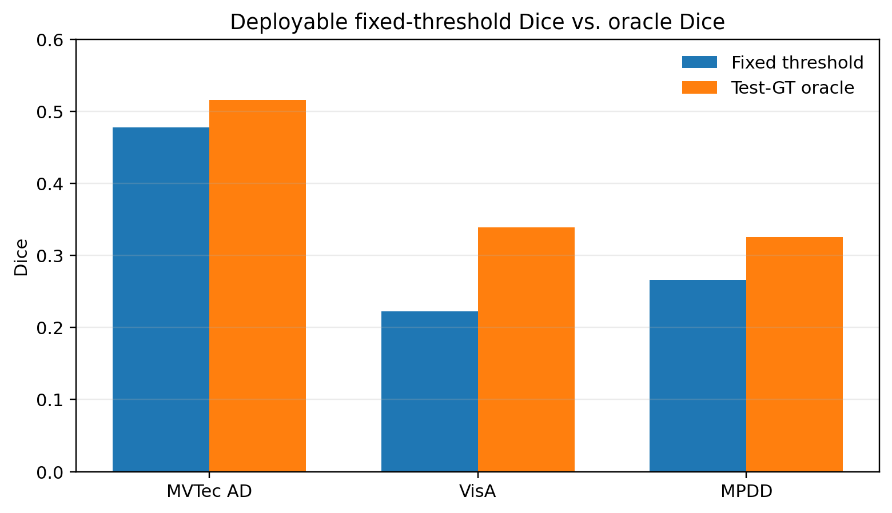
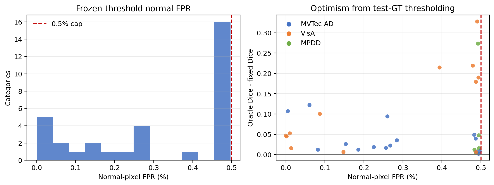
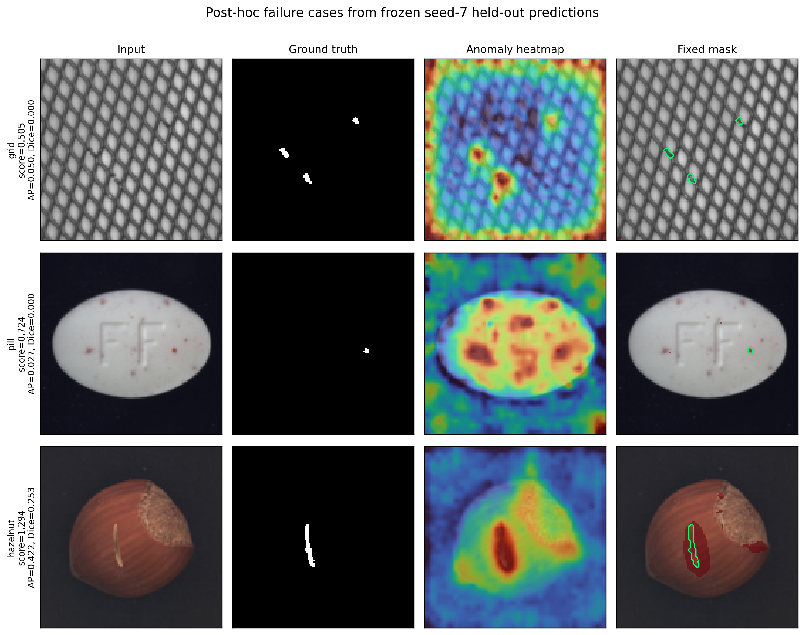

# Lite-SEER-AD: Label-Free Feature-First Industrial Anomaly Localization with Selective Regional Verification

## Abstract

Industrial anomaly detection systems often tune pixel policies with real
anomaly masks or let expensive reconstruction dominate every image. We present
Lite-SEER-AD, a feature-first framework that freezes a normal-feature detector,
selects localization policies with retained normal images and deterministic
synthetic defects, and invokes regional verification only where needed. The
paper-facing detector is separated from HN-SEV region filtering, LC-RDS
latency-aware repair scheduling, and CRV visualization. A fixed pixel threshold
is selected without real anomaly labels or masks under a `0.5%` normal-pixel
false-positive constraint. Across MVTec AD, VisA, and MPDD, 33 category policies
are stable over three held-out seeds. Threshold-independent comparisons against
path-aligned local engineering controls improve AUPRO by `0.0584` and Pixel AP
by `0.0618` on average. HN-SEV lowers FPRR in all 33 categories, while LC-RDS
is faster than fixed25 and rule-based repair in all 33 categories. Seven
external MVTec AD baselines are complete under the same fixed-threshold
protocol. Lite-SEER-AD exceeds the
PaDiM reference on all five reported means and exceeds several official
methods in AUPRO, but DRAEM and RD4AD have higher mean AUPRO and most official
methods have stronger Image AUROC and Pixel AP. We therefore do not claim
universal SOTA or GT-aligned semantic repair.

## 1. Introduction

Unsupervised industrial anomaly detection must operate without representative
defect labels, yet many experimental pipelines still use test masks to choose
pixel thresholds, post-processing, or reconstruction policies. This creates a
gap between reported localization quality and deployable behavior.

Lite-SEER-AD addresses that gap with a feature-first design. A frozen
normal-feature prior produces the main anomaly map. Retained normal images and
deterministic synthetic defects select among predeclared pixel policies and
freeze an operating threshold. Regional modules are evaluated separately:
HN-SEV filters suspicious regions, LC-RDS allocates local diffusion steps under
a latency budget, and CRV is restricted to visualization because its score
drop is not positively aligned with real defect masks.

Our contributions are:

1. A label-free feature-first policy and fixed-threshold protocol using normal
   images and deterministic synthetic defects, with no real anomaly labels or
   masks in category selection.
2. Regional evidence for HN-SEV false-positive suppression and LC-RDS
   latency-aware repair scheduling, evaluated separately from the frozen main
   detector.
3. A 33-category, three-seed evidence package across MVTec AD, VisA, and MPDD,
   including paired uncertainty, policy-stability audits, a provenance-checked
   seven-baseline MVTec AD comparison, and explicit negative findings for CRV
   alignment, retrieval repair, and multiscale variants.

## 2. Related Work

Memory and distribution modeling methods such as PatchCore
[@Roth2022PatchCore] and PaDiM [@Defard2021PaDiM] establish strong
feature-based localization baselines. SimpleNet [@Liu2023SimpleNet], DRAEM
[@Zavrtanik2021DRAEM], reverse distillation [@Deng2022RD4AD], and UniAD
[@You2022UniAD] represent efficient, synthetic-training, distillation, and
unified-model alternatives. DiffusionAD [@Zhang2023DiffusionAD] and DDAD
[@Mousakhan2023DDAD] motivate reconstruction-based verification but incur
substantial compute when applied globally.

Our method does not replace these families with a larger end-to-end model.
Instead, it freezes feature detection, selects the pixel policy without real
defects, and confines diffusion reasoning to optional regional evidence.

## 3. Method

### 3.1 Feature-First Detector

The detector models normal feature patches and produces distance and
cosine-gap heatmaps. The main paper heatmap is frozen before regional
verification. This prevents repair quality from silently changing detector
scores and allows detection and verification claims to be audited separately.

### 3.2 Label-Free Policy Selection

For each category, the candidate pool contains raw and high-resolution feature
maps, fixed normal calibration, Gaussian post-processing, PaDiM variants, and
normal-calibrated fusion. Retrieval and multiscale candidates are included as
predeclared ablations.

Candidate utility combines synthetic Pixel AP, AUPRO, Dice, augmentation
stability, normal-pixel FPR, and measured latency. Evidence from synthetic seeds
`7`, `13`, and `23` is averaged to freeze one candidate. Real anomaly labels
and masks are forbidden selection inputs.

### 3.3 Fixed Pixel Threshold

Let `S_n` be pixel scores on retained normal heatmaps and `(S_s, Y_s)` the
scores and masks of deterministic synthetic defects. We search a deterministic
threshold grid. Feasible thresholds satisfy:

`mean(S_n >= t) <= 0.005`.

Among feasible thresholds, we maximize synthetic Dice, break ties by lower
normal FPR, and then by the higher threshold. If no grid point is feasible, a
normal `99.5` percentile fallback is moved upward by one floating-point step
when needed to preserve the FPR constraint.

The frozen threshold is used for main F1, IoU, and Dice. Test-GT optimized
values are reported only with the `oracle_*` prefix.

### 3.4 HN-SEV and LC-RDS

HN-SEV scores candidate regions from original, reconstruction, residual,
prototype novelty, and optional feature evidence. LC-RDS chooses skip,
10-step repair, or 25-step repair from expected gain, area, novelty, and
remaining latency budget. These modules do not alter the frozen detector
metrics in the main table.

### 3.5 CRV Boundary

CRV measures score change after local repair. Because pooled SDR-GT Spearman
correlation is `-0.1235`, CRV is used only for visual and post-hoc inspection.
It is not evidence of semantic defect removal, mask alignment, or detector
improvement.

## 4. Experimental Protocol

We evaluate MVTec AD (15 categories), VisA (12), and MPDD (6) with held-out
seeds `7/13/23`. The 33 category policies are frozen using cross-seed synthetic
evidence and evaluated on each seed's independent held-out split, yielding 99
main runs.

AUPRO is component-level PRO AUC over background FPR `[0, 0.3]`, with
duplicate-FPR collapse and boundary interpolation. Comparable latency uses
batch size 1, 50 warmups, 200 measurements, and CUDA synchronization.

Bundled baselines are local engineering controls, displayed as
`PatchCore-Local`, `PaDiM-Local`, and `*-Lite`. Separately, we evaluate pinned
external implementations of PatchCore, UniAD, DRAEM, DDAD, RD4AD, and
SimpleNet, plus the maintained Anomalib PaDiM reference. All 105 method-class
artifacts are provenance checked, evaluated by the same metric code, and
receive thresholds from normal and deterministic synthetic evidence only.
DiffusionAD source, data assets, and strict runner are validated, but its
author configuration requires 3000 epochs per class and 663,000 total
optimizer steps. Partial-training checkpoints and predictions are not retained
or included as baseline results. On the available 16-GB GPU, measured
throughput projects to roughly 3,801 aggregate GPU hours, so full reproduction
remains pending remote parallel compute.

For image-level scoring, we additionally predeclare 11 maximum, mean,
percentile, and top-fraction aggregators. Category modes are selected only
from normal and synthetic evidence at seeds `7/13/23`, frozen, and then
audited on held-out data.

## 5. Results

### 5.1 Fixed-Threshold Main Results

| Dataset | Image AUROC | Pixel AUROC | AUPRO | Pixel AP | Fixed Dice | Oracle Dice |
|---|---:|---:|---:|---:|---:|---:|
| MVTec AD | 0.9278 | 0.9785 | 0.9220 | 0.4639 | 0.4778 | 0.5159 |
| VisA | 0.9609 | 0.9865 | 0.8986 | 0.2600 | 0.2222 | 0.3391 |
| MPDD | 0.8198 | 0.9744 | 0.9069 | 0.2762 | 0.2663 | 0.3257 |
| Overall | 0.9202 | 0.9807 | 0.9107 | 0.3556 | 0.3464 | 0.4170 |

All 99 runs use `synthetic_normal_fixed_threshold_v1`. The maximum observed
normal-pixel FPR is `0.4968%`. Fixed Dice is `0.0706` lower than oracle Dice on
average, showing why test-GT threshold selection must not be used for the main
result.

The category-level threshold audit below shows that all frozen policies remain
within the predeclared `0.5%` normal-pixel FPR cap. The right panel quantifies
how much test-GT thresholding would inflate Dice for each category.

### 5.2 Path-Aligned Local Controls

| Metric | Mean delta | 95% bootstrap CI | Category wins |
|---|---:|---:|---:|
| AUPRO | +0.0584 | [+0.0320, +0.0918] | 30/33 |
| Pixel AP | +0.0618 | [+0.0419, +0.0821] | 31/33 |

These metrics are threshold-independent. They compare against path-aligned
local engineering controls and are distinct from the external comparison
below.

### 5.3 External Baseline Comparison

| Method | Image AUROC | Pixel AUROC | AUPRO | Pixel AP | Fixed Dice |
|---|---:|---:|---:|---:|---:|
| Lite-SEER-AD | 0.9278 | 0.9785 | 0.9220 | 0.4639 | 0.4778 |
| PatchCore-Official | 0.9893 | 0.9821 | 0.9114 | 0.6236 | 0.4896 |
| PaDiM-Anomalib | 0.8903 | 0.9596 | 0.8797 | 0.4001 | 0.3731 |
| UniAD-Official | 0.9764 | 0.9703 | 0.9045 | 0.4481 | 0.4332 |
| DRAEM-Official | 0.9805 | 0.9749 | 0.9279 | 0.6886 | 0.5232 |
| DDAD-Official | 0.9888 | 0.9748 | 0.9085 | 0.6325 | 0.3420 |
| RD4AD-Official | 0.9789 | 0.9780 | 0.9339 | 0.5680 | 0.4901 |
| SimpleNet-Official | 0.9900 | 0.9752 | 0.9049 | 0.5705 | 0.3528 |

Lite-SEER-AD exceeds the PaDiM reference on all five means. It has higher mean
AUPRO than PatchCore (`+0.0106`), UniAD (`+0.0174`), DDAD (`+0.0135`), and
SimpleNet (`+0.0171`), but trails DRAEM (`-0.0059`) and RD4AD (`-0.0119`).
Most author-official methods have stronger Image AUROC and Pixel AP. These
results support label-free policy and threshold selection as the contribution;
they do not support overall superiority or SOTA.

Paired inference over the 15 categories confirms only a narrower robust
advantage. Relative to PaDiM, Pixel AUROC improves by `+0.0189` with 95%
bootstrap CI `[+0.0106, +0.0280]` and Holm-adjusted exact sign-test
`p=0.0068`. The PaDiM AUPRO, Pixel AP, and fixed-Dice intervals are positive,
but their Holm-adjusted sign tests are not significant. The positive AUPRO
point estimates against PatchCore, UniAD, DDAD, and SimpleNet all have
intervals crossing zero. DRAEM and DDAD retain statistically supported Pixel
AP advantages after Holm correction.

### 5.4 Stability and Few-Shot Behavior

Candidate agreement is `100%` across the three held-out seeds. MVTec AD
few-shot results improve monotonically from 8 to 32 normal training images:
AUPRO increases from `0.8835` to `0.9100`, Pixel AP from `0.3659` to `0.4213`,
and the historical oracle Dice diagnostic from `0.4276` to `0.4787`.

The separate label-free image-score aggregation audit is negative. Modes
selected from synthetic evidence obtain mean MVTec Image AUROC `0.9263`
versus `0.9278` for the frozen global `top5` rule. Four categories improve,
four degrade, and seven are unchanged. We retain `top5` and do not tune a
post-hoc switching threshold from the held-out labels.

### 5.5 Module Evidence

HN-SEV lowers FPRR in all `33/33` categories, with mean change `-0.9187`.
The ROI-mask audit shows this is not yet recall-safe: TP retention is
`15.92%`, and image-level ROI recall drops from `87.49%` before HN-SEV to
`15.12%` after HN-SEV. We therefore restrict HN-SEV to a false-positive
suppression claim and report the recall loss as a limitation.
LC-RDS is faster than fixed25 by `95.04 ms` and rule repair by `85.05 ms` on
average, with wins in all `33/33` categories. Against fixed10, it is faster in
only `16/33` categories, so no universal fastest-policy claim is made.

## 6. Failure Analysis

Pixel AP remains below the strongest local control for MVTec `hazelnut` and
`capsule`. AUPRO losses occur on VisA `chewinggum` and MVTec `screw` and
`transistor`. These cases indicate mismatch between deterministic synthetic
defect topology and real anomaly size, texture, and boundary structure.

Against the seven external baselines, `grid` is the largest recurring Image
AUROC loss, `pill` is the largest recurring Pixel AP loss, and `hazelnut` is
the largest recurring AUPRO loss. These consistent category failures motivate
better synthetic-to-real calibration rather than another global reconstruction
branch. A direct 11-mode image-score aggregation search was completed and
rejected because its mean held-out Image AUROC decreased by `0.0015`.

The selected diagnostic cases expose three distinct errors: the low-scoring
`grid` anomaly and small `pill` color defect are missed at the frozen
threshold, whereas the `hazelnut` cut is detected but substantially
over-segmented. Ground truth is used only to choose and annotate these
post-hoc examples, never to select the method or threshold.

The complete weak-category taxonomy is provided in
`tables/failure_taxonomy/`. It covers `grid`, `screw`, `pill`, `capsule`,
`hazelnut`, `transistor`, VisA `capsules`, VisA `fryum`, and MPDD
`bracket_white`, and records each remaining failure as a post-hoc diagnostic
boundary rather than a hidden tuning target.

Repair preserves image structure but does not prove semantic correction. On
1,111 anomalous images, mean SSIM is `0.9229`, background PSNR is `29.18 dB`,
and background MAE is `0.00827`; nevertheless, SDR is negatively correlated
with GT occupancy.

## 7. Limitations

1. Seven external baselines are complete, covering `105/120` planned MVTec AD
   method-class entries. The 15 missing entries are the full DiffusionAD
   reproduction, whose author configuration requires 663,000 total optimizer
   steps. Its smoke run validates the pipeline but is not paper eligible;
   partial-training checkpoints and predictions are not retained.
2. The current external comparison is not broad enough to establish SOTA.
3. Synthetic selection uses three deterministic synthesis seeds and may not
   cover all real defect topologies. Its ranking of image-score aggregators
   does not reliably transfer to real defects.
4. CRV lacks positive GT alignment and is not a semantic repair method.
5. Historical latency tables use mixed protocols; only
   `synchronized_batch_latency_v1` and the guarded production inference budget
   audit are comparable. The production six-budget LC-RDS sweep is complete on
   the current hardware profile, and a single-hardware production-style energy
   probe is recorded; cross-hardware validation is still missing.

## 8. Conclusion

Lite-SEER-AD demonstrates that feature-first industrial anomaly localization
can be selected and thresholded without real defect labels, while regional
verification and diffusion scheduling are evaluated as separate modules. The
current evidence supports stable threshold-independent localization gains,
deployable fixed-threshold metrics, HN-SEV false-positive filtering, and LC-RDS
budget savings. The seven-baseline comparison is mixed: Lite-SEER-AD is strong
on AUPRO and strict fixed-threshold behavior, but DRAEM and RD4AD have higher
mean AUPRO and most official methods have stronger image-level detection.
External SOTA is not supported.

## Artifact Checklist

- Strict metrics: `tables/strict_fixed_threshold/`
- Strict paper tables and source figures:
  `tables/strict_fixed_threshold_paper/`
- Manuscript figures: `paper/figures/`
- Main evidence: `tables/feature_first_fusion_aggregate_paper_package/`
- Seven-baseline comparison: `tables/external_baseline_comparison/`
- Paired statistics and failure attribution:
  `tables/external_baseline_comparison/{table_paired_inference.csv,table_worst_category_losses.csv}`
- Image-score aggregation audit:
  `tables/image_score_aggregation_mvtec15/`
- Frozen failure-case panel and case index:
  `tables/failure_case_panel_mvtec15/`
- RD4AD and SimpleNet imports:
  `tables/official_{rd4ad,simplenet}_mvtec15/`
- Official baseline readiness: `tables/official_baseline_readiness/`
- DiffusionAD measured compute plan: `tables/diffusionad_compute_plan/`
- Submission and reproducibility checklist:
  `docs/submission_reproducibility_checklist.md`
- References: `paper/references.bib`
